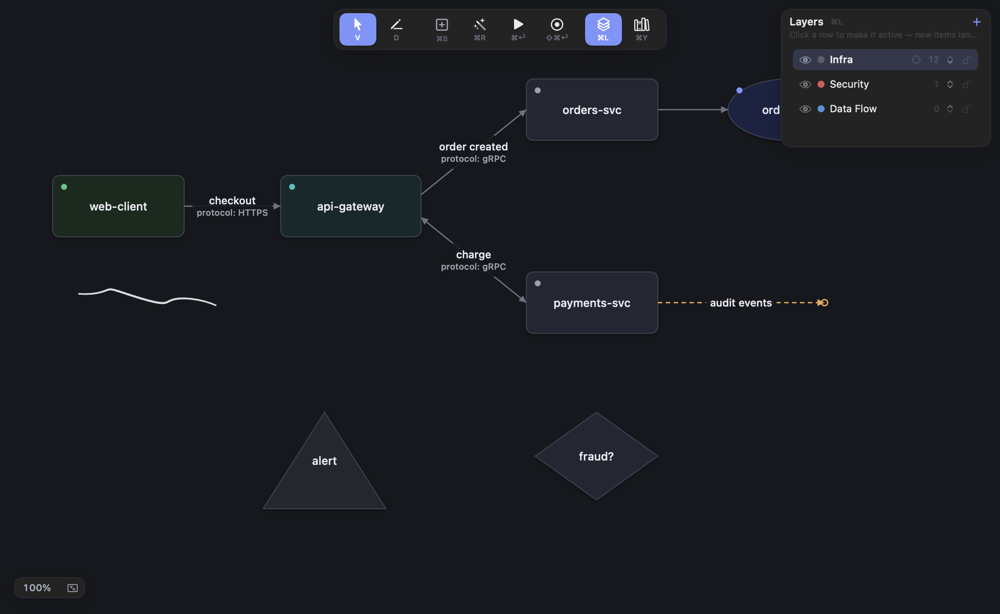

# Designer

A native macOS app for engineering system design: **sketch at whiteboard
speed, keep the result as a structured, reusable, AI-legible artifact.**



Most diagram tools make you choose: fast and messy (whiteboards) or clean
and slow (draw.io-style editors). Designer refuses the trade-off:

- **Sketch becomes structure.** Draw a rough box — it snaps into a real
  block. A rough line between blocks becomes a real connector. A box drawn
  as four separate strokes still becomes one block. Ink that should stay
  ink stays ink.
- **Connectors carry meaning.** An edge isn't a line: it records what moves,
  over which protocol, under which conditions. The board makes data
  transmission legible.
- **One system, many concerns.** Layers are views over the *same* objects —
  the same board reads as infra, security, or data flow without duplication.
- **Diagrams are AI-legible.** The app runs a local MCP server, so Claude
  (or any MCP client) can read the live board and propose edits you review
  as ghosts on the canvas before accepting. There's also a built-in
  assistant panel, billed to your existing Claude subscription — no API key.

## Features

- **Canvas** — infinite pan/zoom, snapping and alignment guides, groups and
  labeled boundaries, proportional multi-selection resize, full undo/redo,
  ⌘K fuzzy command palette. Smooth at 2,000 nodes + 4,000 connectors.
- **Sketch recognition** — rectangles, ellipses, diamonds, triangles, and
  connector lines, live as you draw (toggleable) or on demand with ⌘R;
  multi-stroke shapes chain automatically.
- **Semantic connectors** — label, protocol, payload, and condition badges;
  direction (including bidirectional); parallel connectors between the same
  pair spread apart with staggered labels; connectors curve around blocks
  in their way, and you can bend any connector by dragging it.
- **Traffic simulation** — select a block, hit ⌘↩, and watch data propagate
  wave by wave through the system.
- **Flows** — record the exact journey a request takes by clicking the
  blocks it visits (choosing among parallel connectors), then replay it as
  an animated packet. Isolate a flow to dim everything it doesn't touch.
- **Version history** — named snapshots stored inside the board file:
  preview any version as a diff against the current board, restore with one
  undo step. A snapshot is captured automatically before accepting an
  AI proposal.
- **Library** — save any selection or board as a tagged, searchable,
  re-insertable pattern.
- **Hand-drawn style** — a per-board toggle that renders everything like a
  marker sketch (wobbly outlines, handwritten labels) while staying fully
  structured.
- **Exports & interchange** — PNG, SVG (with semantic `data-*` attributes),
  a lossless text format for pasting into any LLM chat, and two-way
  draw.io + Excalidraw interchange (import their files, export to them).

Boards are folder packages (`.designerboard`) with canonical JSON inside —
diff-able, sync-able, and readable by other tools.

## Install

Designer is currently built from source (no notarized binaries yet).

**Requirements:** macOS 14+, Xcode 16+ with command-line tools.

```sh
git clone git@github.com:ymec97/designer.git
cd designer
scripts/package-app.sh        # → build/Designer-v<version>-<date>.zip
```

Unzip into `/Applications`. The app is ad-hoc signed, so Gatekeeper objects
on first launch of a copied zip:

- macOS 14 or earlier: right-click `Designer.app` → Open → Open
- macOS 15+: launch once, then System Settings → Privacy & Security →
  "Open Anyway"
- or clear quarantine directly: `xattr -dr com.apple.quarantine /Applications/Designer.app`

(An app built on the same machine launches without any of this.)

If `swift build` complains about the toolchain, point it at Xcode once:
`sudo xcode-select -s /Applications/Xcode.app/Contents/Developer`.

## AI setup (optional)

**In-app assistant (⇧⌘A)** — chats with Claude inside Designer and edits
the board through the review flow. It drives the Claude Code CLI, so it's
billed to your Claude subscription:

```sh
npm install -g @anthropic-ai/claude-code
claude        # log in once, then quit
```

**Agent access (MCP)** — let any MCP client read and edit the live board.
In Designer: Board → Enable Agent Access (persists across launches; the
menu shows the active port, normally 51737). Then, for Claude Code:

```sh
claude mcp add --transport http designer http://127.0.0.1:51737/mcp
```

Any MCP client that speaks HTTP can use the same endpoint. Agents get five
tools (guide, describe, read, search, propose); every proposed change
appears as a ghost preview on the canvas and applies only when you accept —
one undo step, with an automatic version snapshot first.

## Keyboard essentials

| Key | Action |
|---|---|
| `V` / `D` | Select / Draw tool |
| double-click | Create a block (⌘B at viewport center) |
| drag from a block's border | Connect to another block |
| `⌘R` | Convert remaining sketches (live conversion handles most as you draw) |
| `⌘↩` / `⇧⌘↩` | Simulate traffic / Record a flow |
| `⌘J` `⌘L` `⌘Y` `⌥⌘I` | Flows / Layers / Library / Inspector |
| `⌃⌘S` / `⇧⌘H` | Save version / Version history |
| `⌘G` / `⌥⌘B` | Group / Boundary around selection |
| `⌘K` | Command palette (fuzzy) |
| `⌘0` / `⌘9` | 100% zoom / Zoom to fit |

## Development

```sh
scripts/build-app.sh                  # debug build → build/Designer.app
cd DesignerKit && swift test          # unit suite
```

End-to-end checks are built into the app binary (no permissions needed):

```sh
build/Designer.app/Contents/MacOS/Designer --ui-test      # synthesized-event walk of every feature
build/Designer.app/Contents/MacOS/Designer --smoke-test /tmp/out.designerboard
build/Designer.app/Contents/MacOS/Designer --perf-test    # frame pacing on a 6k-element board (display must be awake)
```

### Layout

| Path | What |
|---|---|
| `DesignerKit/Sources/DesignerModel` | Pure document model: board, elements, layers, flows, operations. No UI imports. |
| `DesignerKit/Sources/DesignerPersistence` | Canonical JSON, migrations, `.designerboard` package I/O, version archive. |
| `DesignerKit/Sources/DesignerRecognition` | Stroke → shape/connector recognition, multi-stroke chaining. |
| `DesignerKit/Sources/DesignerCanvas` | AppKit canvas: rendering, gestures, simulation playback. |
| `DesignerKit/Sources/DesignerInterop` | LLM text interchange, board diff, SVG export. |
| `DesignerKit/Sources/DesignerAgent` | Local MCP server (loopback HTTP, JSON-RPC). |
| `DesignerKit/Sources/Designer` | App shell: NSDocument, panels, menus, chat bridge. |
| `project.yml` | XcodeGen definition — `Designer.xcodeproj` is generated, don't edit it. |

## Status

**v0.1.0** — first testable release. Full feature list in
[CHANGELOG.md](CHANGELOG.md); product definition and design decisions in
[docs/PRODUCT_BRIEF.md](docs/PRODUCT_BRIEF.md).
